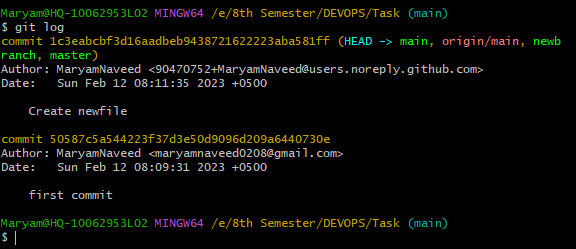

# Some Important Github and Linux Commands 
We will be discussing some essential GitHub commands and Linuc Commands that every developer should know.

## Github Commands
GitHub is one of the largest code hosting platforms and is used by millions of developers across the world. It is a platform that is used for version control and collaboration in software development. With GitHub, developers can store and manage their code, track changes, and collaborate with other developers. 10 essential GitHub commands that every developer should know are: 

### 1.	Git clone: 
The git clone command is used to clone an existing repository from GitHub to your local machine. You can clone a repository by simply running git clone followed by the repository URL.

```
git clone <https://name-of-the-repository-link>
```


### 2.	Git init: 
The git init command is used to initialize a new repository on your local machine. If you want to start a new project on GitHub, you need to run this command first to create a new repository.

```
git init
```


### 3.	Git add: 
The git add command is used to stage changes in your local repository. When you make changes to a file in your repository, you need to run this command to stage those changes before committing them.

#### To add a single file:

```
git add <file>
```


#### To add everything at once:
```
git add -A
```


### 4.	Git commit: 
The git commit command is used to save your changes to the repository. When you run this command, you need to provide a commit message that explains the changes you made.

```
git commit -m "commit message"
```


### 5.	Git push: 
The git push command is used to push changes from your local repository to the remote repository on GitHub. When you run this command, your changes will be uploaded to GitHub and become available to others.

```
git push <remote> <branch-name>
git push -u origin main
```


### 6.	Git pull: 
The git pull command is used to pull changes from the remote repository on GitHub to your local repository. When you run this command, you will receive any changes that have been made by other developers on GitHub.

```
git pull remote
```


### 7.	Git branch: 
The git branch command is used to create, list, and delete branches in your repository. Branches are used to work on different features or fix bugs without affecting the main codebase.

#### Create a new branch:

```
git branch <branch-name>
```


#### List all branches:

```
git branch or git branch --list
```


#### Delete a branch:

```
git branch -d <branch-name>
```


### 8.	Git merge: 
The git merge command is used to merge changes from one branch into another. When you run this command, the changes from one branch will be combined with the changes in another branch.

```
git merge <branch-name>
```


### 9.	Git status: 
The git status command is used to check the status of your repository. When you run this command, it will show you a list of files that have been changed and whether they have been staged or not.

```
git status
```


### 10.	Git log: 
The git log command is used to view a list of all the commits in your repository. When you run this command, you will see a list of all the commits, the author, and the commit message.

```
git log
```



In conclusion, these are 10 essential GitHub commands that every developer should know. By mastering these commands, you will be able to efficiently manage your code and collaborate with other developers on GitHub.

## Linux Commands
Linux is a popular open-source operating system used by developers and system administrators around the world. It provides a rich set of tools and commands that allow you to perform various tasks on the system. Now we’ll be discussing 10 essential Linux commands that every beginner should know.

### 1. pwd
The pwd command is used to print the current working directory. This command displays the full path of the current directory.

The pwd command uses the following syntax:
```
pwd [option]
```


### 2. mkdir
The mkdir command is used to create a new directory. This command creates a new directory with the specified name.

The mkdir command uses the following syntax:
```
mkdir [option] directory_name
```


### 3. touch
The touch command is used to create a new empty file. This command creates a new file with the specified name, or updates the modification time of an existing file.

The touch command uses the following syntax:
```
touch [option] filename
```


### 4. cp
The cp command is used to copy files and directories. This command allows you to make a copy of a file or directory and place it in a different location.

The cp command uses the following syntax:
```
cp [options] source destination
```


### 5. mv
The mv command is used to move or rename files and directories. This command allows you to move files and directories from one location to another, or to rename an existing file or directory.

The mv command uses the following syntax:
```
mv [options] source destination
```


### 6. cat
The cat command is used to display the contents of a file. This command prints the contents of the specified file to the terminal.

The cat command uses the following syntax:
```
cat [options] [file(s)]
```


### 7. grep
The grep command is used to search for text in a file. This command allows you to search for a specific string or pattern in a file, and display the lines that contain that text.

The grep command uses the following syntax:
```
grep [options] pattern [file(s)]
```


### 8. find
The find command is used to search for files and directories. This command allows you to search for files and directories based on various criteria, such as name, size, or modification time.

The find command uses the following syntax:
```
find path expression
```


### 9. chmod
The chmod command is used to change file permissions. This command allows you to control who can read, write, and execute files on the system.

The chmod command uses the following syntax:
```
chmod option modes file(s)
```


### 9. man
The man command is used to view the manual pages for a command. This command displays the manual pages for a specified command, providing detailed information about how to use the command and its options.

The man command uses the following syntax:
```
man [command]
```


In conclusion, these are 10 essential Linux commands that every beginner should know. By mastering these commands, you will be able to perform basic tasks on a Linux system and start to become comfortable with the Linux command line interface.